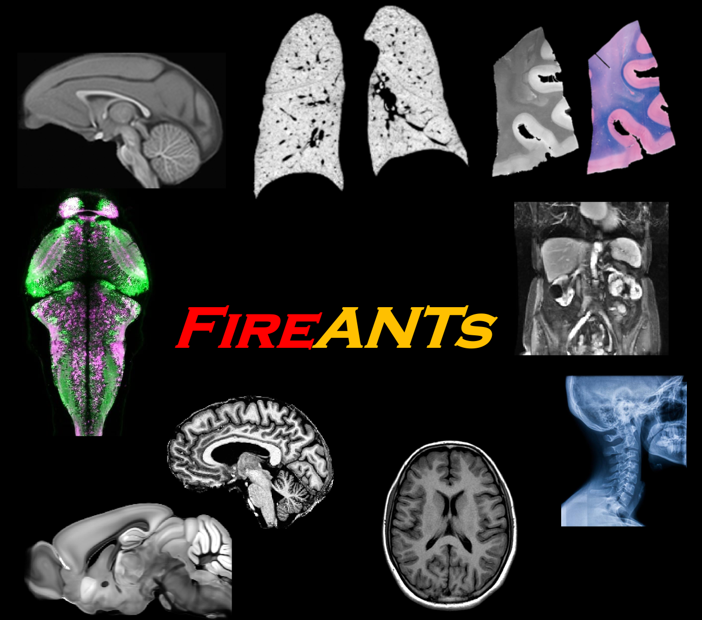
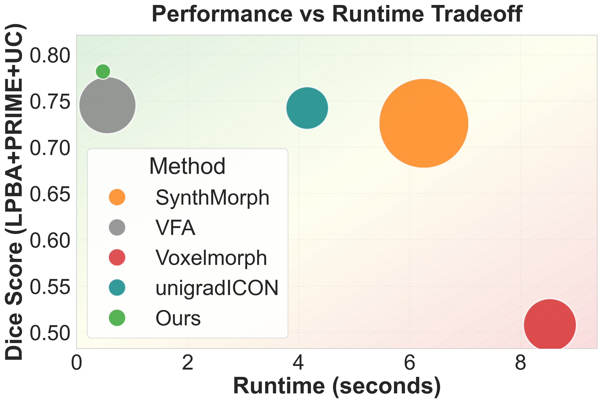
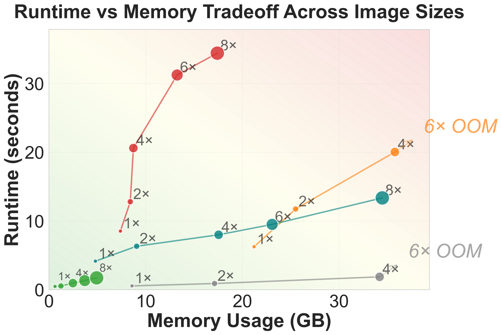
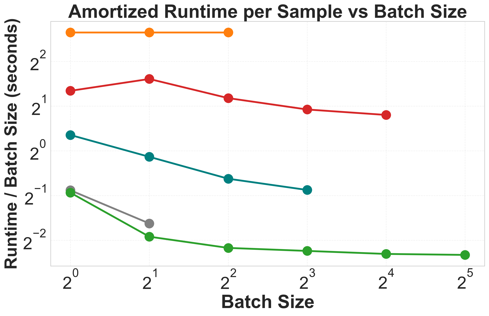

# :fire: FireANTs: Adaptive Riemannian Optimization for Multi-Scale Diffeomorphic Registration

<div style="text-align: center;">
    
</div>

The FireANTs library is a lightweight, general-purpose registration package for Riemannian diffeomorphic registration on GPUs. It is designed to be easy to use, fast, accurate, and extensible.
The salient features of the library include:

- **Powerful optimization algorithms** ⚡️🧠: FireANTs utilizes a novel Riemmanian Adaptive optimization algorithm to perform gradient descent on the space of diffeomorphisms. Diffeomorphisms are a deformable transforms that do not lie on a Euclidean manifold, and hence require specialized optimization algorithms.
- **Blazing fast inference** 🚀: FireANTs is much faster at inference than most other registration libraries, including deep learning methods. 
- **Lightweight** 🧩: FireANTs consumes about 10x less memory than state-of-the-art deep learning methods, scaling easily to high resolution images.
- **Batched Registration** 📚: Simultaneously register multiple image pairs with ease, which reduces runtime per image pair to upto 250ms per image pair on a single GPU.

<div style="display: flex; justify-content: space-between;">
    
    
    
</div>

- **Composable transforms** 🔗⚡️: FireANTs provides a simple API for composing transforms. You can easily compose multiple transforms and apply the composition to images directly. This avoids aliasing due to multiple resampling. Check out the [documentation](https://fireants.readthedocs.io/en/latest/) for more details.

*FireANTs achieves up to 10x speedup compared to traditional registration methods and deep learning approaches while improving accuracy and runtime.*

## Installation 
To use the FireANTs package, you can either 

- Use Docker (see [docker/README.md](docker/README.md), _highly recommended_)
- Clone the repository and install the package locally
- Install the package directly from PyPI.

If you do not want to use Docker, we recommend using a fresh Anaconda/Miniconda environment to install the package.
```
conda create -n fireants python=3.9
```

To install FireANTs locally:
```
git clone https://github.com/rohitrango/fireants
cd fireants
pip install .
cd fused_ops && python setup.py build_ext && python setup.py install && cd ..
```

By default, doing `pip install .` will **NOT** include the fused CUDA operations. 
I highly recommend installing the fused CUDA operations using the command above.

Or install from PyPI (does not install fused ops):
```
pip install fireants
```

## Tutorial
To check out some of the tutorials, check out the `tutorials/` directory for usage.
Alternatively, to reproduce the results in the [paper](https://arxiv.org/abs/2404.01249) checkout the `fireants/scripts/` directory.

## Fused CUDA Operations
If you want to use the fast and memory efficient fused CUDA operations, you can install the `fireants_fused_ops` package. See [fused_ops/README.md](fused_ops/README.md) for a basic user guide.

## CLI Tools
FireANTs provides command-line interface tools similar to the original ANTs toolkit. For detailed instructions and available tools, see [cli/README.md](cli/README.md).

## Template building
FireANTs includes a powerful template builder for creating anatomical templates from medical images. For detailed instructions, configuration options, and usage examples, see [fireants/scripts/template/README.md](fireants/scripts/template/README.md).

## Documentation
You can also check out the [Documentation](https://fireants.readthedocs.io/en/latest/). Feel free to reach out to me for improvements in the documentation.

## Datasets
In the paper, we use the datasets as following: 
* Klein's evaluation of 14 non-linear registration algorithms: [here](https://www.synapse.org/#!Synapse:syn3251018)
* EMPIRE10 lung registration challenge: [here](https://empire10.grand-challenge.org/)
* Expansion Microscopy dataset: [here](https://rnr-exm.grand-challenge.org/)

## Contributing
Feel free to [add issues](https://github.com/rohitrango/fireants/issues/new) or [pull requests](https://github.com/rohitrango/fireants/compare) to the repository. We welcome contributions to the package.

## Tests

To run the tests, run the following command:
```bash
bash run_tests.sh
```
Feel free to report any issues with the tests to the [issues](https://github.com/rohitrango/fireants/issues/new) page.

## License
Please refer to the [LICENSE](LICENSE) file for the license details, especially pertaining to redistribution of code and derivative works.

## Citation

If you use FireANTs in your research, please cite the following papers:

```
@article{jena2024fireants,
  title={FireANTs: Adaptive Riemannian Optimization for Multi-Scale Diffeomorphic Registration},
  author={Jena, Rohit and Chaudhari, Pratik and Gee, James C},
  journal={arXiv preprint arXiv:2404.01249},
  year={2024}
}

@article{jena2025scalable,
  title={A Scalable Distributed Framework for Multimodal GigaVoxel Image Registration},
  author={Jena, Rohit and Zope, Vedant and Chaudhari, Pratik and Gee, James C},
  journal={arXiv preprint arXiv:2509.25044},
  year={2025}
}
```

If you use FireANTs-as-a-layer ([Deep Implicit Optimization](https://www.sciencedirect.com/science/article/pii/S1361841525001240?via%3Dihub), [code](https://github.com/rohitrango/DIO)), cite the following paper:
```
@article{jena2025deep,
  title={Deep implicit optimization enables robust learnable features for deformable image registration},
  author={Jena, Rohit and Chaudhari, Pratik and Gee, James C},
  journal={Medical Image Analysis},
  volume={103},
  pages={103577},
  year={2025},
  publisher={Elsevier}
}
```
