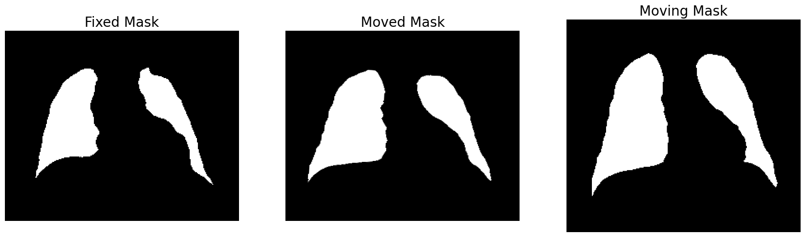
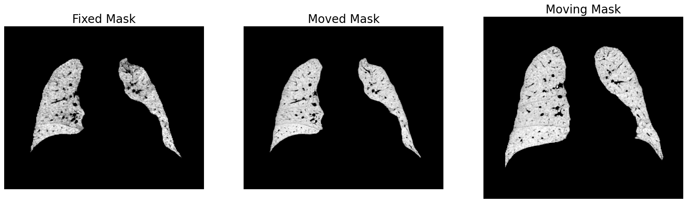

# Custom loss functions in FireANTs

This section shows a powerful feature of FireANTs - arbitrary metrics for registration. This will empower users to define their own loss functions for registration, which is paramount for custom modalities where existing metrics may not be suitable.

In this example, we want to perform lung registration with access to binary lung masks.

First, we load the images and masks:

```python
from fireants.io import Image, BatchedImages
from fireants.registration.affine import AffineRegistration
from fireants.registration.greedy import GreedyRegistration
import matplotlib.pyplot as plt
from time import time

import torch
from torch import nn

# load images and masks
# here we're combining the image loading and batch loading
fixed_image = BatchedImages(Image.load_file("lung_images/01_Fixed.nii.gz"))
moving_image = BatchedImages(Image.load_file("lung_images/01_Moving.nii.gz"))

fixed_mask = BatchedImages(Image.load_file("lung_masks/01_Fixed.nii.gz"))
moving_mask = BatchedImages(Image.load_file("lung_masks/01_Moving.nii.gz"))
```

Since there are gross anatomical differences between the fixed and moving images, we will first perform an affine registration of the binary lung masks followed by a deformable registration of the intensity images.

### Affine registration using Dice loss

Note that tools like ANTs / Greedy do not have built-in support for complex metrics like Dice loss. Most existing workflows perform MSE loss between images, which may not be suitable for skewed masks. Implementing a custom loss is also a nightmare in these tools.

In contrast, FireANTs allows you to define your own loss functions with ease. Here, we define a Dice loss for the binary masks.
Custom loss functions are defined as a subclass of the `nn.Module` class in PyTorch.

```python
class DiceLossModule(nn.Module):
    # Dice loss in the form of nn Module to pass into affine step 
    # assumes a single class only (for brevity)
    def __init__(self):
        super().__init__()
    
    def forward(self, moved_seg, fixed_seg, *args, **kwargs):
        # flatten the images into [B, N] and the compute dice score
        moved_flat = moved_seg.flatten(1)
        fixed_flat = fixed_seg.flatten(1)
        num = 2*(moved_flat*fixed_flat).sum(1)
        den = moved_flat.sum(1) + fixed_flat.sum(1)
        return 1 - (num/den).mean()
```

This was only a few lines of code!

Next, we perform the affine registration using the Dice loss:

```python
affine = AffineRegistration([6, 4, 2, 1], [200, 100, 50, 20], fixed_mask, moving_mask, \
           loss_type='custom', custom_loss=DiceLossModule(), optimizer='Adam', \
            optimizer_lr=3e-3, optimizer_params={}, cc_kernel_size=5)
aff_start = time()
affine.optimize()
aff_end = time()
```

Note that the only changes we made were to define `loss_type='custom'` and pass the custom loss function module to the `custom_loss` argument.
Since the custom loss module is a subclass of `nn.Module`, it can also be stateful and have trainable parameters.


Here is how the affine transformed masks look like:

```python
# Visualize the masks
fig, ax = plt.subplots(1, 3, figsize=(21, 7))
ax[0].imshow(fixed_mask()[0, 0, :, 200].cpu().numpy(), 'gray'); ax[0].invert_yaxis(); ax[0].axis('off')
ax[1].imshow(moved_mask[0, 0, :, 200].detach().cpu().numpy(), 'gray'); ax[1].invert_yaxis(); ax[1].axis('off')
ax[2].imshow(moving_mask()[0, 0, :, 200].cpu().numpy(), 'gray'); ax[2].invert_yaxis(); ax[2].axis('off')
# set titles
ax[0].set_title("Fixed Mask", fontsize=20)
ax[1].set_title("Moved Mask", fontsize=20)
ax[2].set_title("Moving Mask", fontsize=20)
```



Note that the fixed and moving images are not of the same voxel sizes, and FireANTs deforms the moving image to the space of the fixed image.

### Subsequent Deformable Registration 

We can use the affine matrix obtained from the previous step (by aligning masks) as initialization for the deformable registration (on images).

```python
affine_matrix = affine.get_affine_matrix()

deformable = GreedyRegistration(scales=[6, 4, 2, 1], iterations=[200, 150, 75, 25], 
                        fixed_images=fixed_image, moving_images=moving_image,
                        cc_kernel_size=5, 
                        deformation_type='compositive',
                        max_tolerance_iters=1000,
                        smooth_grad_sigma=6, smooth_warp_sigma=0.4, 
                        optimizer='Adam',
                        optimizer_lr=0.25, init_affine=affine_matrix)

start = time()
deformable.optimize()
end = time()
```

And we can visualize the results:

```python

moved_image = deformable.evaluate(fixed_image, moving_image)

# Visualize the masks
fig, ax = plt.subplots(1, 3, figsize=(21, 7))
ax[0].imshow(fixed_image()[0, 0, :, 200].cpu().numpy(), 'gray'); ax[0].invert_yaxis(); ax[0].axis('off')
ax[1].imshow(moved_image[0, 0, :, 200].detach().cpu().numpy(), 'gray'); ax[1].invert_yaxis(); ax[1].axis('off')
ax[2].imshow(moving_image()[0, 0, :, 200].cpu().numpy(), 'gray'); ax[2].invert_yaxis(); ax[2].axis('off')
# set titles
ax[0].set_title("Fixed Mask", fontsize=20)
ax[1].set_title("Moved Mask", fontsize=20)
ax[2].set_title("Moving Mask", fontsize=20)
```



This registration takes $ \sim 30 $ seconds on a single GPU. On ANTs, this takes about 8-12 hours.

Deep learning-based registration typically works only on very small images, and quickly runs out of memory for larger images like the ones shown above.
Moreover, most deep learning methods require the `fixed` and `moving` images to be of the same size, which is not the case here (and a lot of relevant applications).