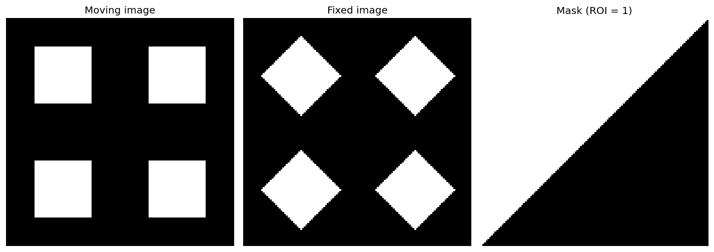
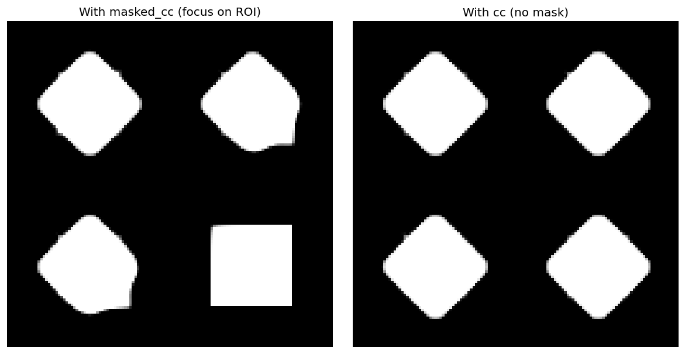

# Basics of Masked Registration 

When only a region of interest (ROI) should drive the registration, you can use **masked** loss functions. The loss is computed only where the mask is non-zero, so the rest of the image does not pull the deformation. FireANTs supports masked variants of CC and MSE by concatenating a mask channel to each image and prefixing the loss name with `masked_`.

## Fixed, moving, and mask

In this example we align a moving image (axis-aligned square) to a fixed image (same square rotated 45°). A diagonal half-plane mask defines the ROI where we care about the match.



- **Moving image**: axis-aligned square.
- **Fixed image**: same square rotated 45°.
- **Mask**: 1 inside the ROI (diagonal half-plane), 0 outside. Only this region contributes to the loss.

## Both images must have a mask channel

The loss expects the **last channel** of each image to be the mask. You must pass images with shape `[N, C+1, ...]`: `C` image channels plus one mask channel.

- If **both** fixed and moving have a real mask, concatenate each mask to its image (so fixed has `[image_channels, fixed_mask]`, moving has `[image_channels, moving_mask]`). The loss uses the element-wise product (or configurable combination) of the two masks.
- If only **one** image has a mask (e.g. only the moving image has an ROI mask), use the helper **`generate_image_mask_allones`** for the other image so it has a mask channel of all ones. That way the effective weight is 1 everywhere for that image and the other image’s mask defines the ROI.

Example: fixed has no mask, moving has a mask. Create an all-ones mask for fixed, then concatenate:

```python
from fireants.io.image import BatchedImages, Image
from fireants.io.imagemask import apply_mask_to_image, generate_image_mask_allones
from fireants.registration.greedy import GreedyRegistration

# Load fixed and moving images and your ROI mask (e.g. moving_mask)
fixed_image = Image.load_file("fixed.nii.gz")
moving_image = Image.load_file("moving.nii.gz")
moving_mask  = Image.load_file("moving_roi.nii.gz")  # same shape as moving_image

# Fixed: no mask → use all-ones mask so we have [image, mask] with mask=1 everywhere
fixed_with_mask = apply_mask_to_image(fixed_image, generate_image_mask_allones(fixed_image))

# Moving: append real mask → [image, mask]
moving_with_mask = apply_mask_to_image(moving_image, moving_mask)

fixed_batch = BatchedImages([fixed_with_mask])
moving_batch = BatchedImages([moving_with_mask])
```

## Enabling masked mode: the `masked_` prefix

You do **not** need to pass any extra loss parameters. Prefix the loss name with **`masked_`** and the registration will use the masked version of that loss and treat the last channel as the mask (e.g. Gaussian smoothing in the pipeline is applied only to image channels, not the mask).

```python
reg = GreedyRegistration(
    scales=[2, 1],
    iterations=[100, 50],
    fixed_images=fixed_batch,
    moving_images=moving_batch,
    loss_type="masked_cc",   # or "masked_mse"
    optimizer="Adam",
    optimizer_lr=0.5,
    smooth_warp_sigma=0.5,
    smooth_grad_sigma=1.0,
)
reg.optimize()
moved = reg.evaluate(fixed_batch, moving_batch)  # first channels = image, last = warped mask
```

So: **`loss_type="masked_cc"`** or **`loss_type="masked_mse"`** is enough to enable masked mode.

## Masked vs non-masked result

When the loss is masked, the optimizer focuses on matching inside the ROI; outside the ROI the deformation is less driven by image similarity. When you use the standard loss without masks, the whole image is used and the result can look different.

Below: **left** — moved image using **masked_cc** (masks concatenated, loss only in ROI); **right** — moved image using **cc** (no masks, same registration settings).



With **masked_cc**, alignment in the diagonal ROI is prioritized and the rest of the field is less constrained. With **cc**, the entire image contributes to the loss, so the deformation is influenced everywhere.

## Summary

1. **Last channel = mask** for both fixed and moving (shape `[N, C+1, ...]`).
2. Use **`generate_image_mask_allones(image)`** when one image has no mask, then **`apply_mask_to_image(image, mask)`** to append the mask channel.
3. Set **`loss_type="masked_cc"`** or **`loss_type="masked_mse"`** to use masked losses; no other options required.
4. The pipeline will smooth only image channels across scales, not the mask channel.
