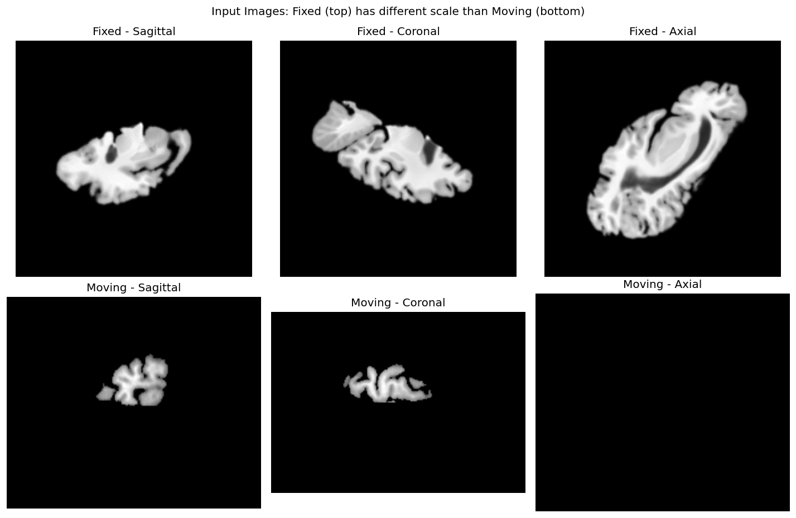
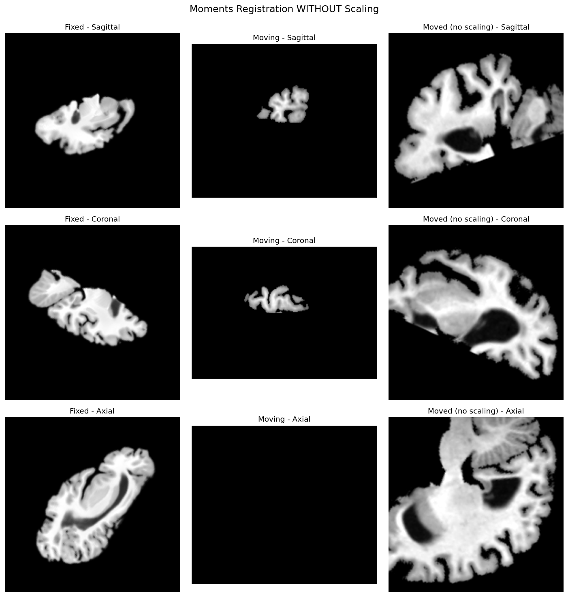
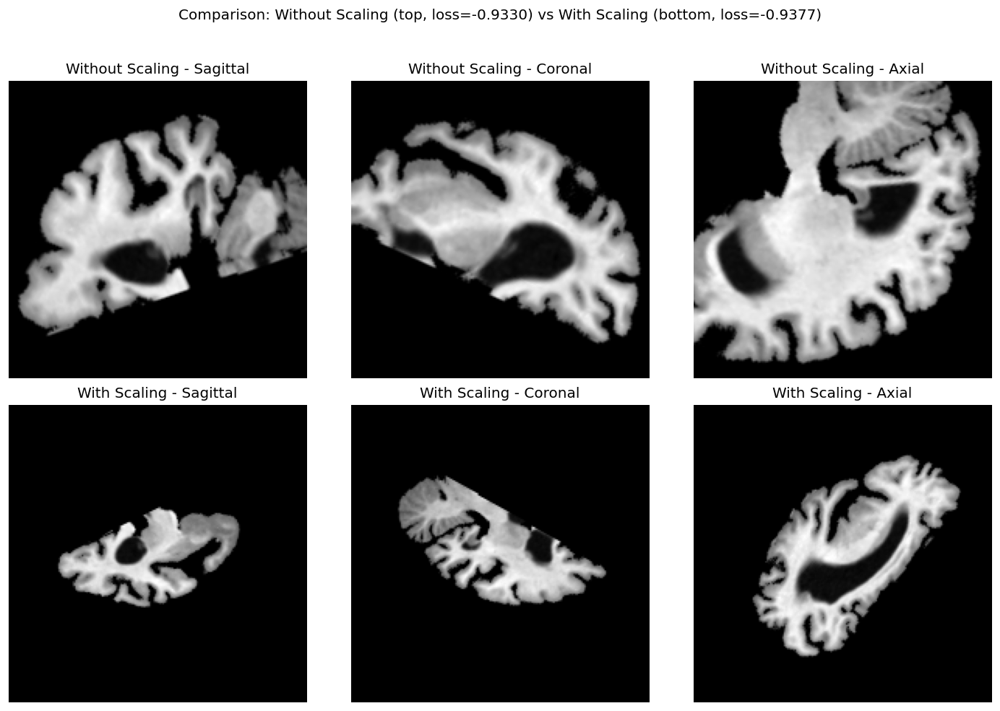

# Moments Matching with Scale Correction

When fixed and moving images have different scales, standard moments matching may produce suboptimal results. This guide shows how to enable scale correction in moments registration to handle images with different scales.



## When to use scaling correction

Moments-based registration aligns images using their statistical moments (center of mass, orientation, etc.). By default, it assumes that images have similar scales. However, in certain scenarios, scale differences exist:

- **Longitudinal stretching in ex-vivo imaging**: Tissue samples may be stretched or compressed during preparation
- **Incorrect scaling factors**: Images from different scanners may have incorrect or inconsistent voxel spacing
- **Multi-modal registration**: Different imaging modalities may capture the same anatomy at different scales
- **Atlas-to-subject registration**: Template atlases may not match the subject's anatomy scale

In these cases, enabling `perform_scaling=True` with `moments=2` allows the registration to compensate for scale differences.

## How scaling correction works

When `perform_scaling=True`, the moments matching algorithm computes a scaling matrix from the eigenvalues of the second-order moment matrices:

$$ S = \sqrt{\text{diag}\left(\frac{\lambda_{\text{moving}}}{\lambda_{\text{fixed}}}\right)} $$

where $\lambda_{\text{fixed}}$ and $\lambda_{\text{moving}}$ are the eigenvalues of the second-order moment matrices of the fixed and moving images, respectively.

The final transformation becomes:

$$ \mathbf{R} = \mathbf{U}_{\text{fixed}} D S \mathbf{U}_{\text{moving}}^T $$

This allows the registration to correct for anisotropic scaling between images.

## Basic usage

```python
from fireants.io.image import Image, BatchedImages
from fireants.registration.moments import MomentsRegistration

# Load images
fixed_img = Image.load_file("fixed.nii.gz")
moving_img = Image.load_file("moving.nii.gz")

# Create batched images
fixed_images = BatchedImages([fixed_img])
moving_images = BatchedImages([moving_img])

# Moments registration WITH scaling
moments = MomentsRegistration(
    scale=4,              # downscale for faster computation
    fixed_images=fixed_images,
    moving_images=moving_images,
    moments=2,            # REQUIRED: use 2nd order moments
    orientation='rot',    # try rotations
    loss_type='cc',       # cross-correlation loss
    perform_scaling=True, # ENABLE scaling correction
)

# Run optimization
moments.optimize()
```

!!! warning "Important"
    Scale correction requires `moments=2`. First-order moments (`moments=1`) only compute translation and do not support scaling.

## Key parameters

| Parameter | Description | Required for scaling |
|-----------|-------------|---------------------|
| `moments` | Order of moments (1 or 2) | Must be `2` |
| `perform_scaling` | Enable scale correction | `True` |
| `orientation` | Rotation handling: `'rot'`, `'antirot'`, or `'both'` | Optional |
| `scale` | Downscaling factor for faster computation | Optional |
| `loss_type` | Loss function: `'cc'`, `'mse'`, etc. | Optional |

## Comparing results with and without scaling

Here's a complete example comparing registration with and without scaling:

```python
import torch
from torch.nn import functional as F
from fireants.io.image import Image, BatchedImages
from fireants.registration.moments import MomentsRegistration

# Load images
fixed_img = Image.load_file("fixed.nii.gz", dtype=torch.float32)
moving_img = Image.load_file("moving.nii.gz", dtype=torch.float32)
fixed_images = BatchedImages([fixed_img])
moving_images = BatchedImages([moving_img])

def run_registration(fixed_images, moving_images, perform_scaling):
    """Run moments registration and return the moved image."""
    moments = MomentsRegistration(
        scale=4,
        fixed_images=fixed_images,
        moving_images=moving_images,
        moments=2,
        orientation='rot',
        loss_type='cc',
        perform_scaling=perform_scaling,
    )
    moments.optimize()
    
    # Apply transformation
    warp_params = moments.get_warp_parameters(fixed_images, moving_images)
    grid = F.affine_grid(warp_params['affine'], warp_params['out_shape'], align_corners=True)
    moved = F.grid_sample(
        moving_images(), 
        grid.to(moving_images().dtype), 
        mode='bilinear', 
        align_corners=True
    )
    return moved, moments

# Without scaling
moved_no_scale, reg_no_scale = run_registration(fixed_images, moving_images, False)

# With scaling
moved_with_scale, reg_with_scale = run_registration(fixed_images, moving_images, True)

# Compare loss using the registration's loss function
# The loss_fn attribute uses the same loss type specified during registration (e.g., 'cc')
loss_no_scale = reg_no_scale.loss_fn(moved_no_scale, fixed_images()).mean().item()
loss_with_scale = reg_with_scale.loss_fn(moved_with_scale, fixed_images()).mean().item()

print(f"Loss without scaling: {loss_no_scale:.6f}")
print(f"Loss with scaling: {loss_with_scale:.6f}")
```

## Visual comparison

When images have different scales:

- **Without scaling**: The moved image may appear incorrectly zoomed in/out, with poor alignment to the fixed image. This manifests as unnecessary zoom-in or incorrect orientation.



- **With scaling**: The moved image should align better with the fixed image, properly compensating for scale differences between the images.


### Side-by-side comparison

The comparison below shows the difference between registration results with and without scaling correction:



## Examining the affine transform

You can examine the computed affine matrices to see the effect of scaling:

```python
# Get affine matrices
affine_no_scale = reg_no_scale.get_affine_init()
affine_with_scale = reg_with_scale.get_affine_init()

print("Affine matrix WITHOUT scaling:")
print(affine_no_scale[0].cpu().numpy())

print("\nAffine matrix WITH scaling:")
print(affine_with_scale[0].cpu().numpy())

# The difference shows the scaling component
print("\nDifference (scaling effect):")
print((affine_with_scale[0] - affine_no_scale[0]).cpu().numpy())
```

## Composing with other transforms

After moments registration with scaling, you can use the result to initialize affine registration:

```python
from fireants.registration.affine import AffineRegistration

# Get the initialized affine from moments
init_affine = reg_with_scale.get_affine_init()

# Use as initialization for affine registration
affine_reg = AffineRegistration(
    scales=[4, 2, 1],
    iterations=[100, 50, 25],
    fixed_images=fixed_images,
    moving_images=moving_images,
    init_rigid=init_affine,  # Initialize with moments result
    optimizer='Adam',
    optimizer_lr=3e-3,
)
affine_reg.optimize()
```

## Saving the transform

Save the registration transform for later use:

```python
# Save as ANTs-compatible format
reg_with_scale.save_as_ants_transforms("moments_transform.txt")

# Or save as .mat file
reg_with_scale.save_as_ants_transforms("moments_transform.mat")
```

## Summary

| Scenario | `perform_scaling` | `moments` |
|----------|------------------|-----------|
| Images have similar scales | `False` (default) | 1 or 2 |
| Images have different scales | `True` | 2 (required) |
| Translation only needed | N/A | 1 |
| Rotation + translation needed | `False` | 2 |
| Rotation + translation + scale | `True` | 2 |

!!! tip "Best Practice"
    When unsure whether images have different scales, try both options and compare the loss or visual alignment. If scaling improves the result significantly, your images likely have scale differences.
