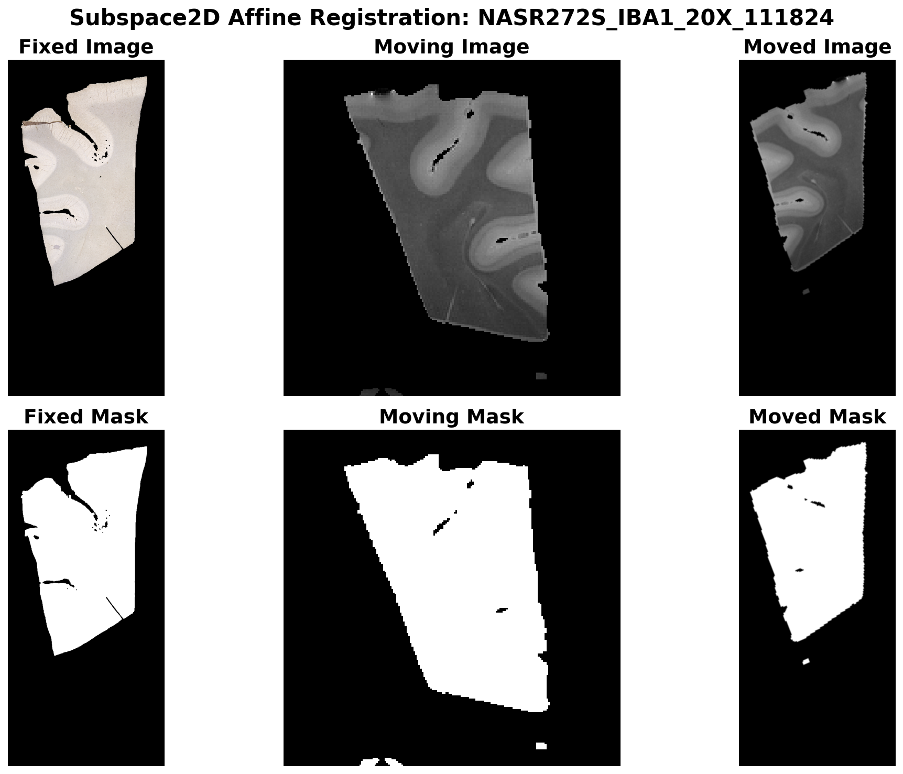
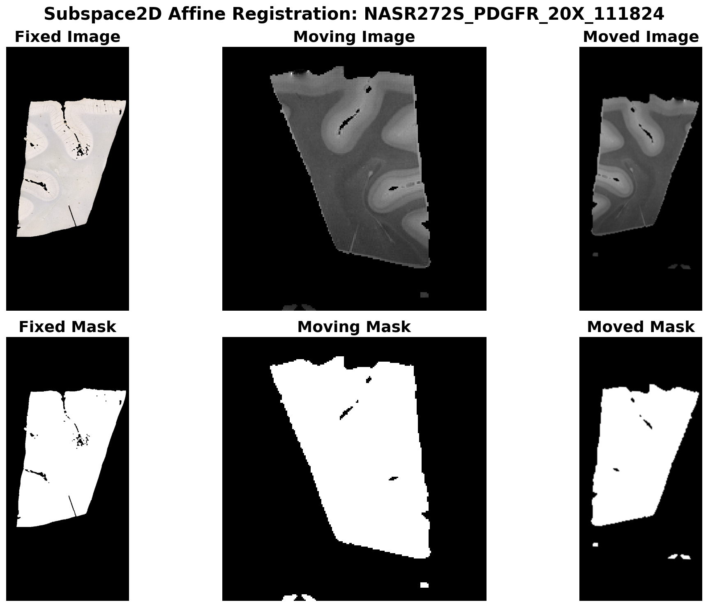
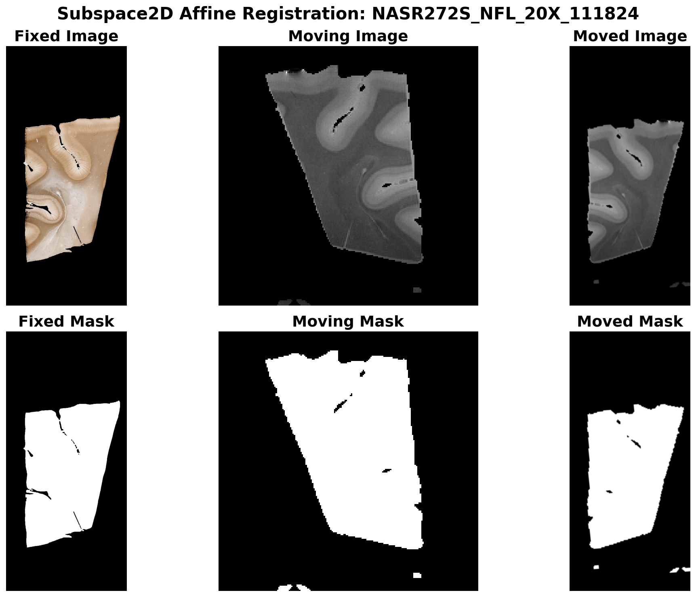
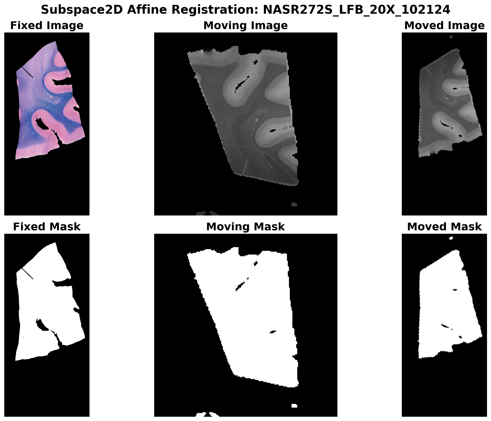

# 2D Affine Registration via Subspace (Contour) Matching

`Subspace2DAffineRegistration` estimates a 2D affine transform by matching object silhouettes: it extracts contours from fixed and moving images, converts them to physical space, and aligns the shapes using an SVD-based subspace method with a rotation search. This gives a fast, geometry-based initial alignment ideal as a starting point for affine or deformable registration.

The examples below use real histology images and MRI-derived masks from the assets folder.

## When to use it

- **2D only**: Supports 2D images only.
- **Single channel**: Fixed and moving must be single-channel masks (can be probability maps but will be thresholded to binary masks internally).
- **Silhouette/contour alignment**: Images are thresholded to binary masks; contours are extracted and matched. Best when objects have clear boundaries (masks, segmentations).
- **Initialization**: The computed affine is in physical space (`y = A x + t`) and is ideal as `init_rigid` for `AffineRegistration` or `init_affine` for `GreedyRegistration`.


## Basic usage

### With real histology images

The following example uses real histology masks and MRI-derived masks from the assets folder:

```python
from pathlib import Path
from fireants.io import Image, BatchedImages
from fireants.registration.subspace2daffine import Subspace2DAffineRegistration

assets_dir = Path("docs/docs/assets/subspaceaffine")

# Load moving (MRI) mask and image
moving_mask = Image.load_file(assets_dir / "dwi_image_mask.nii", device='cpu')
moving_img = Image.load_file(assets_dir / "t2_image.nii", device='cpu')
moving_mask_batch = BatchedImages([moving_mask])
moving_img_batch = BatchedImages([moving_img])

# Fixed: histology mask (single-channel 2D)
fixed_mask = Image.load_file(assets_dir / "NASR272S_SMA_20X_111824_mask.png", device='cpu')
fixed_mask.array = (fixed_mask.array > 0).float()
fixed_batch = BatchedImages([fixed_mask])

reg = Subspace2DAffineRegistration(
    fixed_images=fixed_batch,
    moving_images=moving_mask_batch,
    orientation="both",
)
reg.optimize()

moved = reg.evaluate(fixed_batch, moving_img_batch)
moved_np = moved.detach().cpu().numpy()[0, 0]
```

### Example results

The following visualizations show the registration results for different histology stains. Each shows the fixed image/mask (histology), moving image/mask (MRI), and the moved (registered) image/mask:









## Orientation parameter

| Value        | Description                          |
|-------------|--------------------------------------|
| `'rot'`     | Pure rotations (det = +1).           |
| `'antirot'` | One flip plus rotations.             |
| `'both'`    | Try both; use when image may be flipped. |

## Chaining with Affine and Deformable registration

The subspace affine transform can be used as initialization for more refined registration:

```python
from fireants.registration.affine import AffineRegistration
from fireants.registration.greedy import GreedyRegistration
from torch import nn

class Dice2DModule(nn.Module):
    def forward(self, fixed, moving, *args, **kwargs):
        p, q = fixed.flatten(1), moving.flatten(1)
        inter = (p * q).sum(1)
        union = p.sum(1) + q.sum(1) + 1e-5
        return (1 - (2 * inter / union).mean())

# Subspace → Affine refinement
affine_reg = AffineRegistration(
    scales=[4, 2, 1],
    iterations=[200, 100, 50],
    fixed_images=fixed_batch,
    moving_images=moving_mask_batch,
    loss_type="custom",
    custom_loss=Dice2DModule(),
    optimizer="Adam",
    optimizer_lr=1e-2,
    init_rigid=reg.get_affine_matrix(),
    progress_bar=False,
)
affine_reg.optimize()

# Deformable from refined affine
deformable_reg = GreedyRegistration(
    scales=[1.5, 1],
    iterations=[500, 500],
    fixed_images=fixed_image_batch,
    moving_images=moving_img_batch,
    loss_type="cc",
    smooth_warp_sigma=0.05,
    smooth_grad_sigma=0.7,
    cc_kernel_size=[71, 21],
    optimizer="Adam",
    optimizer_lr=0.5,
    init_affine=affine_reg.get_affine_matrix(),
    progress_bar=False,
)
deformable_reg.optimize()
moved_deformable = deformable_reg.evaluate(fixed_image_batch, moving_img_batch)
```

## How it works

1. **Contour extraction**: Binary mask (e.g. `image > 0`) → largest external contour in voxel space (OpenCV).
2. **Voxel → physical**: Contour points transformed using each image’s `px2phy`.
3. **Shape normalization**: Centered and normalized via SVD to get a subspace representation.
4. **Rotation search**: Brute-force search over rotations (and optionally a flip via `orientation`) minimizes robust Chamfer distance between normalized shapes.
5. **Affine composition**: Best rotation is combined with fixed/moving shape parameters → final affine in physical space.

## API summary

| Method | Description |
|--------|-------------|
| `optimize()` | Compute affine for all batch elements. |
| `get_affine_matrix(homogenous=True)` | Affine in physical space: `[N, 3, 3]` or `[N, 2, 3]`. Convention: `y = A x + t`. |
| `evaluate(fixed_images, moving_images, shape=None)` | Resample moving images into fixed space. |
| `get_warp_parameters(...)` | Dict with `affine` and `out_shape` for `fireants_interpolator`. |
| `get_inverse_warp_parameters(...)` | Inverse transform (fixed → moving). |

## Tips

- **OpenCV**: Contour extraction uses `cv2.findContours`; install `opencv-python`.
- **Masks**: Internally uses `image > 0`; pre-threshold or pre-segment for cleaner contours.
- **Visualization**: The example images above were generated using `docs/scripts/generate_subspaceaffine_images.py`.
