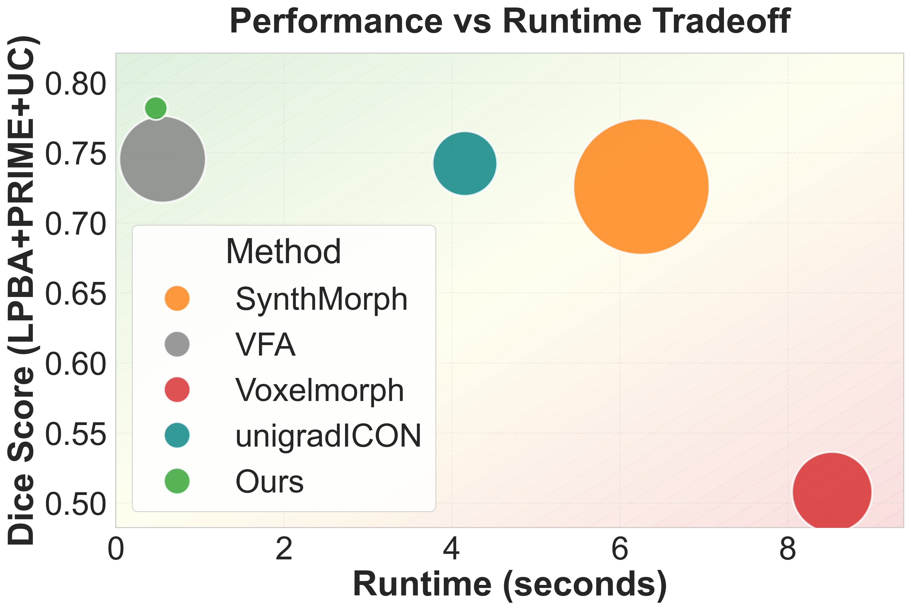
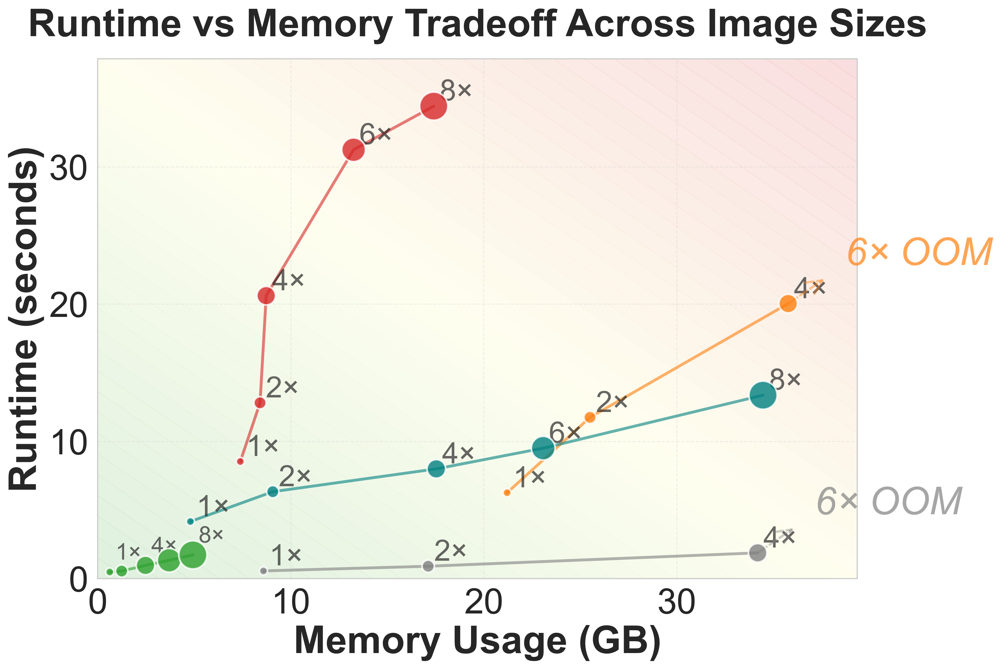
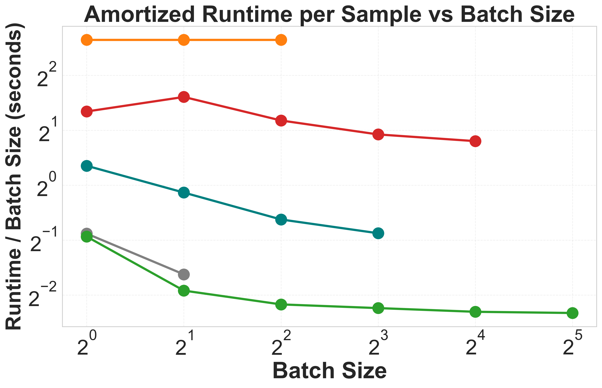

# 🔥 FireANTs

  <a href="https://github.com/rohitrango/FireANTs" target="_blank" style="width: 30%; text-align: center; background-color: #6C757D; color: white; padding: 10px; border-radius: 5px; margin-right: 2%; margin-bottom: 10px; text-decoration: none;">
     <b>GitHub</b>
  </a>

  <a href="https://arxiv.org/abs/2404.01249" target="_blank" style="width: 30%; text-align: center; background-color: #007BFF; color: white; padding: 10px; border-radius: 5px; margin-bottom: 10px; text-decoration: none;">
    <b>
    📝 Paper
    </b>
  </a>

## Introduction

FireANTs is a lightweight library for *really* fast (medical) image registration using Adaptive Riemannian Optimization on GPUs. 
It is developed by <a target="_blank" href="https://jenaroh.it">Rohit Jena</a> at the *Penn Image Computing and Science Lab* (PICSL) at the University of Pennsylvania. 

<!--  -->

The primary motivation for developing this software is:

* Tools like ANTs are notoriously slow to run, making it difficult to use and scale them in practice.   
* Image registration is a massively parallelizable problem, making it a hotbed for clever GPU algorithms.   
* Existing tools are also difficult to extend and customize, making it hard to experiment with new ideas and adapt to novel domains. Most users have to be content with the functionality and scripts provided by the software.   
* Most optimization algorithms still use vanilla SGD, which is slow and inefficient for large-scale optimization problems.   

FireANTs mitigates *all* these problems by providing a lightweight, easy-to-use, fast, accurate, and extensible library for medical image registration. 
It is built on top of the popular [PyTorch](https://pytorch.org) library and provides a simple API for registering images.

The salient features are:

* **Powerful optimization algorithms ⚡️🧠**: FireANTs utilizes a *novel Riemmanian Adaptive optimization* algorithm to perform gradient descent on the space of diffeomorphisms. *Diffeomorphisms* are a deformable transforms that do not lie on a Euclidean manifold, and hence require specialized optimization algorithms.    
* **Massively parallelizable 🧮**: FireANTs leverages the massively parallelizable nature of image registration problems. Most ops are carefully designed and optimized for GPUs.    
* **Super fast 🚀**: Experiments that used to take hours to run now take seconds on cheaper hardware. Experiments that were impossible before now take a few days.   
* **Batched Registration 📚**: Unlike other software, FireANTs also supports *batched registration*. Simultaneously register multiple image pairs with ease.   
* **Easy to use 🛠**: FireANTs provides a simple API for registering images. You can load, register, and save images with just a few lines of code.   
* **Composable transforms 🔗⚡️**: FireANTs provides a simple API for composing transforms. You can easily compose multiple transforms and apply the composition to images directly. This avoid aliasing due to multiple resampling.   
* **Extensible 🧩**: FireANTs is built on top of PyTorch, which makes it easy to extend and customize the library. One can easily add new loss functions, metrics, and optimization algorithms to the library *with a few lines of code*. Adding custom loss functions and extending existing algorithms is extremely easy. Checkout the [tutorial](customloss.md) for more.   
* **Works with arbitrary image sizes**: In a lot of clinical applications (in-vivo to ex-vivo or histology, microscopy, etc.), the image sizes can vary significantly and the two images may not be of the same size either. FireANTs is designed to work with arbitrary image sizes and can handle large images with ease.   

Some performance benchmarks:

    
    
    

 

!!! info "More Details"

    Check out more details in the [paper](https://arxiv.org/abs/2404.01249) for the algorithm details, benchmark results and runtime analysis.

