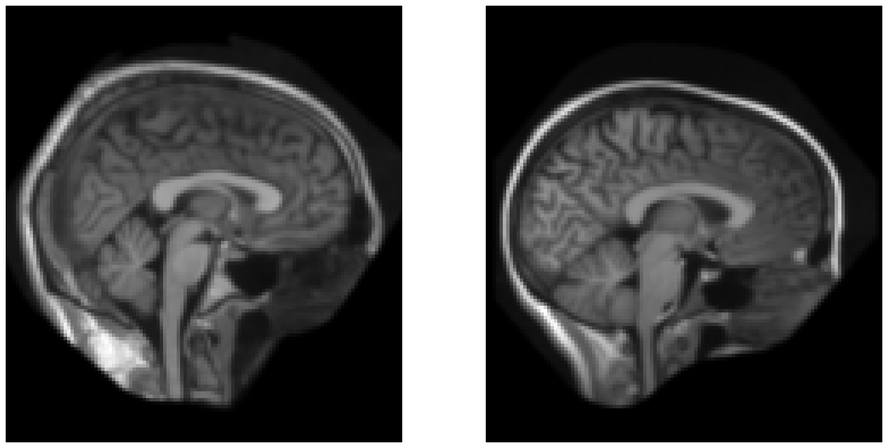
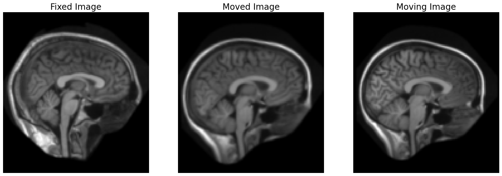
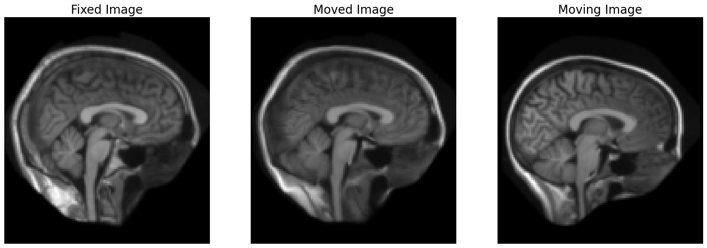

# Quickstart

This section aims to provide a quick overview of the capabilities of FireANTs. We will register brain MRI scans to one another.
In image registration, one image is `fixed` and the other is `moving`. The goal is to find a transformation that aligns the moving image to the fixed image.

## Preliminaries

Import necessary modules:

```python
from fireants.io import Image, BatchedImages
from fireants.registration.affine import AffineRegistration
from fireants.registration.greedy import GreedyRegistration
import matplotlib.pyplot as plt
import SimpleITK as sitk
from time import time
```

Next, we load the `fixed` and `moving` images. We will use the `Image` class to load the images. The `Image` class is a wrapper that loads the image and necessary metadata into GPU.

However, all the registration algorithms expect a "batch" of images. To keep abstraction consistent, we use the `BatchedImages` class to batchify the images. We can pass either a single image or list of multiple images to the `BatchedImages` class.

Load the images from the `tutorial` directory:

```python
# load the images
image1 = Image.load_file("atlas_2mm_1000_3.nii.gz")
image2 = Image.load_file("atlas_2mm_1001_3.nii.gz")
# batchify them (we only have a single image per batch, but we can pass multiple images)
batch1 = BatchedImages([image1])
batch2 = BatchedImages([image2])
```

Optionally, we can visualize the images using matplotlib:

```python
# visualize the images
fig, ax = plt.subplots(1, 2, figsize=(20, 10))
ax[0].imshow(batch1()[0, 0, :, :, 48].cpu().numpy(), 'gray'); ax[0].invert_yaxis(); ax[0].axis('off')
ax[1].imshow(batch2()[0, 0, :, :, 48].cpu().numpy(), 'gray'); ax[1].invert_yaxis(); ax[1].axis('off')
```

You should see an image like this:




## Affine Registration

In this section, we will perform an affine registration step followed by a deformable registration step.
Since deformable registration is susceptible to local minima, we will first perform an affine registration to get a good initial guess.
An affine registration ensures an `approximate' alignment to kickstart the deformable registration.

Set the registration parameters:

```python
# specify some values
scales = [4, 2, 1]  # scales at which to perform registration
iterations = [200, 100, 50]
optim = 'Adam'
lr = 3e-3
```

Perform the affine registration:

```python
# create affine registration object
affine = AffineRegistration(scales, iterations, batch1, batch2, optimizer=optim, optimizer_lr=lr,
                            cc_kernel_size=5)
# run registration
start = time()
affine.optimize(); torch.cuda.synchronize()
end = time()
```

Performing an affine registration is as easy as that! Now let's visualize the results:

```python
moved = transformed_images[-1]
# visualize the images
fig, ax = plt.subplots(1, 3, figsize=(21, 7))
ax[0].imshow(batch1()[0, 0, :, :, 48].cpu().numpy(), 'gray'); ax[0].invert_yaxis(); ax[0].axis('off')
ax[1].imshow(moved[0, 0, :, :, 48].detach().cpu().numpy(), 'gray'); ax[1].invert_yaxis(); ax[1].axis('off')
ax[2].imshow(batch2()[0, 0, :, :, 48].cpu().numpy(), 'gray'); ax[2].invert_yaxis(); ax[2].axis('off')
# set titles
ax[0].set_title("Fixed Image", fontsize=20)
ax[1].set_title("Moved Image", fontsize=20)
ax[2].set_title("Moving Image", fontsize=20)
```



The affine transform aligned the moving image to overlap more with the fixed image, but there wasn't much to align in the first place. Therefore, only the anterior portion of the skull seems a little deformed.

## Deformable Registration

Let's run deformable registration and see the difference.

```python
reg = GreedyRegistration(scales=[4, 2, 1], iterations=[200, 100, 25], 
            fixed_images=batch1, moving_images=batch2,
            cc_kernel_size=5, deformation_type='compositive', 
            smooth_grad_sigma=1, 
            optimizer='adam', optimizer_lr=0.5, init_affine=affine.get_affine_matrix().detach())
start = time()
reg.optimize()
end = time()
```

Note that we used `affine.get_affine_matrix().detach()` to initialize the deformable registration with the affine transformation matrix obtained from the affine registration. This is a good practice to ensure that the deformable registration starts from a good initial guess, and the implementation makes sure that the image is resampled not more than once.

Let's visualize the results:

```python
# visualize the images
moved = reg.evaluate(batch1, batch2)

fig, ax = plt.subplots(1, 3, figsize=(21, 7))
ax[0].imshow(batch1()[0, 0, :, :, 48].cpu().numpy(), 'gray'); ax[0].invert_yaxis(); ax[0].axis('off')
ax[1].imshow(moved[0, 0, :, :, 48].detach().cpu().numpy(), 'gray'); ax[1].invert_yaxis(); ax[1].axis('off')
ax[2].imshow(batch2()[0, 0, :, :, 48].cpu().numpy(), 'gray'); ax[2].invert_yaxis(); ax[2].axis('off')
# set titles
ax[0].set_title("Fixed Image", fontsize=20)
ax[1].set_title("Moved Image", fontsize=20)
ax[2].set_title("Moving Image", fontsize=20)
```




## Saving the image
To save the moved image or any other image that you want to transform, you can use the `FakeBatchedImages` class.

```python
moved_image = reg.evaluate(fixed_batch, moving_batch)
moved_batch = FakeBatchedImages(moved_image, fixed_batch)  # this uses the metadata of the fixed batch but the content of the moved image
moved_batch.write_image("1000_1001_moved.nii.gz")
```

## Saving warp in ANTs format

If you are interested in using FireANTs, chances are you are already an (unhappy with the runtime) ANTs user. Part of the reason for developing FireANTs was to provide a faster and better alternative to ANTs. However, the rest of your workflow need not suffer!

We can save the images in ANTs format.

```python
reg.save_as_ants_transforms("1000_1001_warp.nii.gz")
```

You can use the saved warp to run `antsApplyTransforms` on your images as you would with ANTs.

```bash
!antsApplyTransforms -d 3 -i atlas_2mm_1001_3.nii.gz -r atlas_2mm_1000_3.nii.gz -t 1000_1001_warp.nii.gz -o antsMoved.nii.gz
```

This legacy support ensures that you can use FireANTs in your existing workflows without any hiccups.
